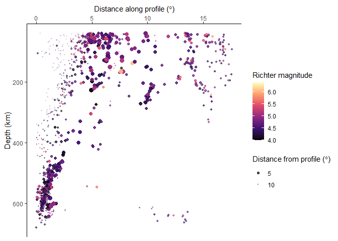

<!-- README.md is generated from README.Rmd. Please edit that file -->

# geoprofiler

<!-- badges: start -->

[](https://github.com/tobiste/geoprofiler/actions/workflows/R-CMD-check.yaml)
<!-- badges: end -->

The goal of geoprofiler is to get distances along and across
user-defined profile lines or transects. This is useful when variables
depend on distances.

## Installation

You can install the development version of geoprofiler from
[GitHub](https://github.com/) with:

``` r
# install.packages("devtools")
devtools::install_github("tobiste/geoprofiler")
```

## Example

This is a basic example which shows you how to create a profile

``` r
library(geoprofiler)
library(ggplot2)
#> Warning: package 'ggplot2' was built under R version 4.3.3
```

Import example data and transfer them into a `sf` object:

``` r
data(quakes)
quakes_sf <- sf::st_as_sf(quakes, coords = c("long", "lat"), crs = "WGS84")
```

Create a profile line from two known points:

``` r
profile <- data.frame(lon = c(160, -170), lat = c(-15, -30)) |>
  sf::st_as_sf(coords = c("lon", "lat"), crs = "WGS84") |>
  sf::st_shift_longitude() |>
  profile_line()
```

> Note: You can also create a profile line by a direction via
> `profile_points()`

Calculate the distances of all points along and across the profile line:

``` r
quakes_profile <- profile_coords(quakes_sf, profile = profile) |>
  dplyr::bind_cols(quakes_sf)
```

Finally, create your profile plot:

``` r
ggplot(quakes_profile, aes(X, depth, color = mag, size = abs(Y), alpha = abs(Y))) +
  geom_point() +
  scale_color_viridis_c("Richter Magnitude", option = "A") +
  scale_size_continuous(bquote("Distance from profile (" * degree * ")"), range = c(3, .1)) +
  scale_alpha_continuous(bquote("Distance from profile (" * degree * ")"), range = c(1, .1)) +
  scale_y_reverse() +
  scale_x_continuous(guide = guide_axis(position = "top")) +
  labs(x = bquote("Distance along profile (" * degree * ")"), y = "Depth (km)") +
  theme_classic()
```


